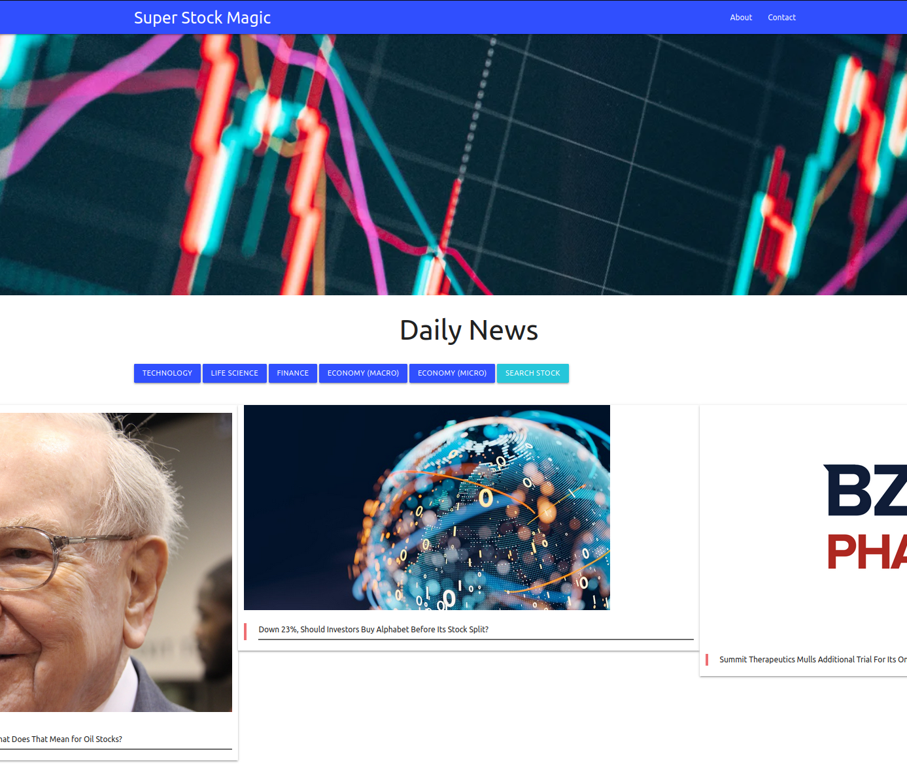

# **Super Stock Magic**
This is a stock market news and analysis dashboard for all your latest and greatest stock news!

## **About this Project**
This project was created to provide a stock market dashboard to get the latest news from many well known stock news sites. (Specifically, we grab articles from zacks.com, investors.com, fool.com, benzinga.com, and more.) It is also capable of specific stock ticker lookup to get more detailed financial info of a certain stock. This ticker lookup pools data from two stock lookup apis: Alpha Vantage[^1] & iexCloud[^2].

## **Project Criteria**
For this project, we wanted to follow some criteria to be pushing ourselves in our coding ability as well as create something we'd really be proud of.

- First criteria was to be styling with a CSS framework we were unfamiliar with. For this project, we chose to go with the Materialize CSS framework[^3].
- We also wanted to deploy this site online, so others could access & use it. In this case, we deployed to GitHub Pages, because it makes deployment easier.
- Additionally, user input was a big thing we wanted to implement. This is why the stock ticker search was implemented. It seemed like a logical addition to this project.
- From a development perspective, we wanted to access at least two different api's. This is partially beneficial for our learning and pushing our abilities. In addition, having multiple data sources for financial information hardens this application a little, since we aren't merely relying on one api for detailed stock info.
- Another challenge for ourselves was limiting our basic javascript interaction in favor of more polished javascript connected css in addition to jQuery[^4]. (The use of modals, as well as css search forms.) This was implemented for us to push our ability in front end development to create something visually appealling as well as functional.
- Watchlists? That's right - everyone and their firstborn daughter has a stock watchlist. Another challenge we created for ourselves was to save a user's watchlist, so they could come back to the site, and not need to worry about remembering the tickers of companies they've been looking at. 
- While we were toying around with some of the Materialize CSS framework, we realized a challenge we'd like to accomplish is to have a responsive, and beautiful UI for this project. Since we were using a CSS framework, we created a criteria for ourselves to have a clean, polished UI, that was also responsive. Part of this meant implementing a Google font api[^5] as well as Moment.js[^6] to display the local time easily and beautifully.
- Being new developers, something else we wanted to make sure we were sticking to is best practices for our repository as well as our code. This includes making professional and descriptive commits, following file structure best practices for organization as well as naming conventions. (This also includes providing a proper, formal README :wink:)

## Mock-Up

### Technologies Implemented
[^1]: [Alpha Vantage API](https://www.alphavantage.co/)

[^2]: [iexCloud API](https://www.iexcloud.io/)

[^3]: [Materialize CSS Framework](https://materializecss.com/)

[^4]: [jQuery](https://jquery.com/)

[^5]: [Google Font API](https://developers.google.com/fonts/docs/getting_started)

[^6]: [Moment.JS](https://momentjs.com/)
